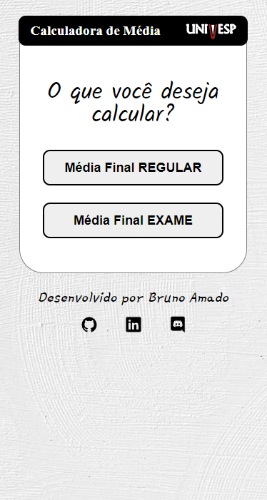
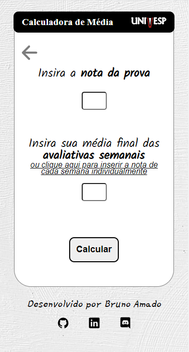
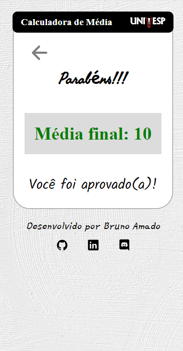

<h1 align="center"> Calculadora de Média UNIVESP </h1>
<h2 align="center">Acesse a calculadora: <a href="https://bruamado.github.io/calculadora-univesp/">https://bruamado.github.io/rocketseat-discover/</a></h2>
 

  
  
  

 Projeto desenvolvido em HTML, CSS e Javascript puro.

 
 
 

# 📖Fórmulas utilizadas

- Média Final Regular: (**Média Avaliativas semanais*0,4** + **Prova regular*0,6**) / 2

- Média Exame: (**Média Final Regular** + **Prova Exame**) / 2

- Média Avaliativas Semanais: (**Semana1*0,08** + **Semana2*0,12** + **Semana3*0,17** + **Semana4*0,17** + **Semana5*0,17** + **Semana6*0,17** + **Semana7*0,12** )